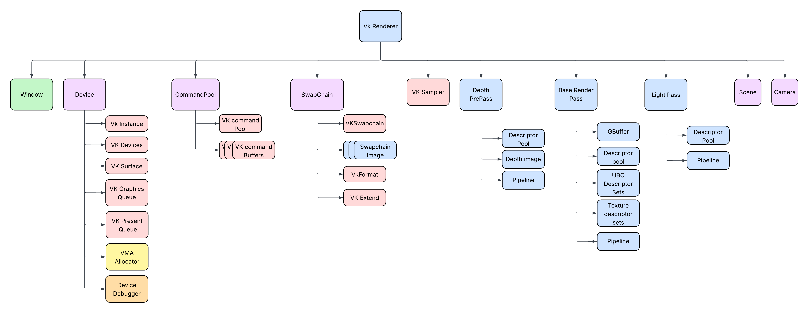
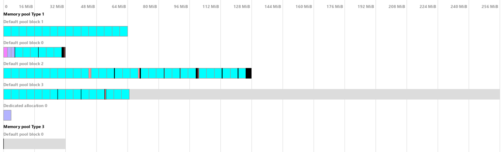
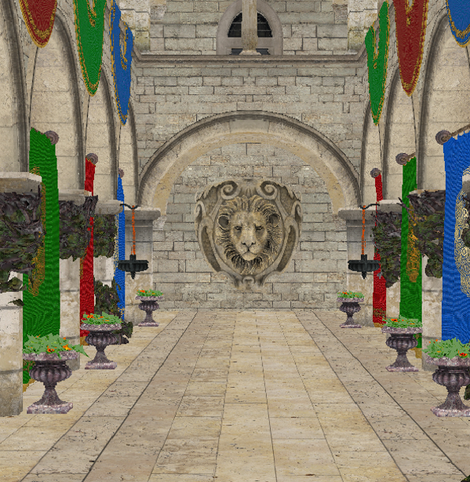
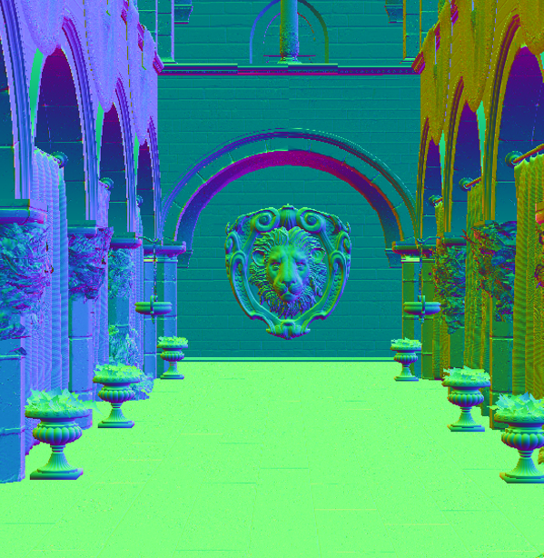
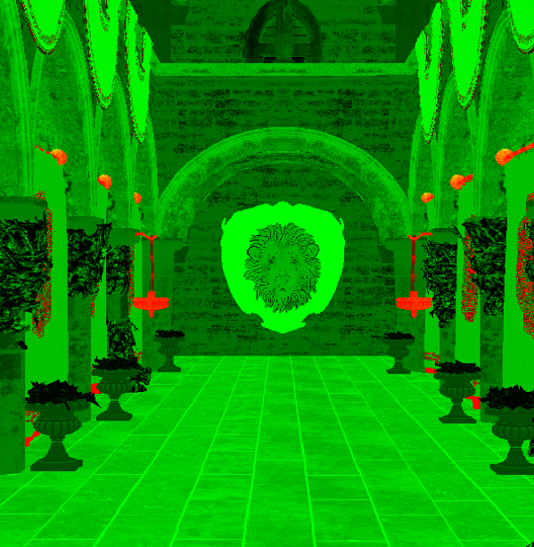
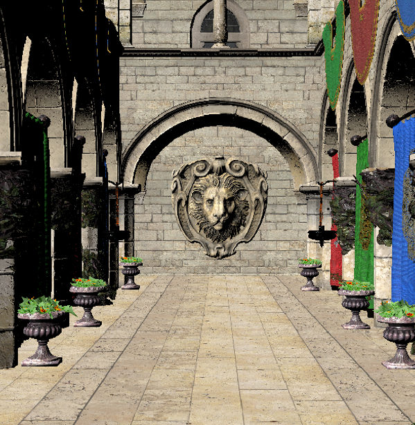
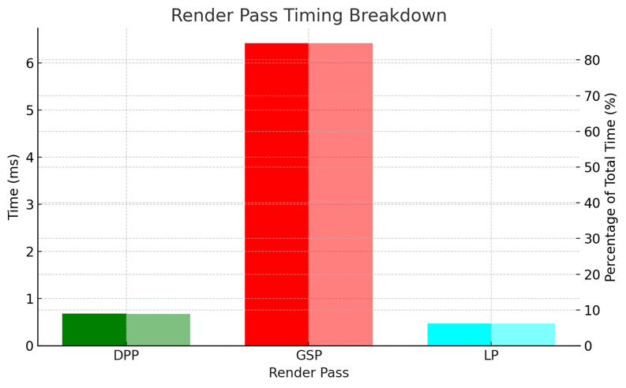

# Graphics Programming 2 - DAE

Name: Gilles Durnez

Username: WOLFGillesD

Github: https://github.com/Howest-DAE-GD/graphics-programming-2-vulkan-project-GillesDurnez

# Vulkan Deferred Renderer - Sponza Demo  
(GP2 Final Project - Gilles Durnez)

> Real-time deferred PBR renderer written from scratch in C++17 + Vulkan 1.3.  
> Runs the classic **Sponza** scene, instruments each render pass, and visualises
> performance with Nsight Graphics.

---

## Table of Contents
1. [Architecture](#architecture)  
2. [Features](#features)  
3. [Memory Overview](#memory-overview)  
4. [Frame Dissection](#frame-dissection)  
5. [Performance Statistics](#performance-statistics)  
---

## Architecture

| Stage | Responsibility |
|-------|----------------|
| **Depth-Pre-Pass (DPP)** | Samples depth of all objects in scene |
| **G-Buffer Pass (GSP)** | Writes world-space normals, albedo, metal-rough into GBuffer |
| **Light Pass (LP)** | Presents the final Cook-Torrance Image |

All passes are built through a small **Pipeline DSL** (see `PipelineConfig`), letting us keep shaders, dynamic-state, and formats in a single place.

---

## Features

* **Cook-Torrance PBR** using GGX NDF + Smith/Schlick terms  
* **Variable-descriptor-count** bindless textures (`VK_DESCRIPTOR_BINDING_VARIABLE_DESCRIPTOR_COUNT_BIT`)  
* **Dynamic Rendering (VK_KHR_dynamic_rendering)** - no fixed render-pass objects  
* **Nsight Debug Labels** for pass boundaries  
* **CMake ExternalProject** automatically downloads the Khronos glTF sample assets (see [`cmake/Sponza.cmake`](cmake/Sponza.cmake))  

---

## Memory Overview

---

## Frame Dissection

| Order | Pass | Clear | Image | GPU Time (ms*) |
|-------|------|-------|-------|----------------|
| 1 | Depth-Pre-Pass | depth = 1             |  | **0.68** |
| 2 | G-Buffer Pass  | colour x3, none depth |  | **6.42** |
| 2 | G-Buffer Pass  |                       |  | **6.42** |
| 2 | G-Buffer Pass  |                       |  | **6.42** |
| 3 | Light Pass     | colour                |  | **0.47** |

*Captured on RTX 4050Ti laptop GPU (debug build).*

---

## Performance Statistics

> Green = Depth pre pass, Red = G-buffer pass, Cyan = Light Pass.

---
